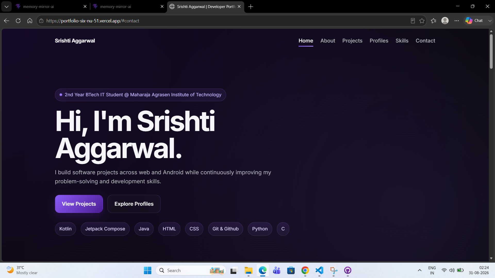

# Srishti Aggarwal — Developer Portfolio

A professional developer portfolio showcasing my projects, technical skills, coding profiles, and development work across web and Android development.

---

## 🌐 Live Website

**[Visit My Portfolio](https://portfolio-six-nu-51.vercel.app/)**

---

## 🎥 Portfolio Walkthrough

Click the cover image below to watch the complete portfolio walkthrough on YouTube.

[](https://youtu.be/h345lv1bFsE)


---

## 📌 Overview

This portfolio website is designed to present my technical background, projects, skills, and developer profiles in a structured and professional manner.

The website includes:

* Professional introduction and developer profile
* Featured projects with live demos and source code
* Technical skills and technologies
* GitHub, LinkedIn, LeetCode, and HackerRank profiles
* Responsive design for desktop, tablet, and mobile devices
* Smooth navigation and scrolling
* Interactive hover effects and animations
* Mobile-friendly navigation menu
* Contact section with social and email links

---

## 🚀 Featured Projects

### 1. Memory Mirror AI

A voice-powered reflection platform that compares a user's past and present voice reflections to identify meaningful changes in communication and expression over time.

**Key Features:**

* Voice journaling
* Past vs. present voice comparison
* Automatic speech transcription
* Speech metrics
* AI-powered reflection analysis
* Personalized insights
* Google authentication
* Cloud storage

**Technologies:**

`React` `Vite` `JavaScript` `Tailwind CSS` `Node.js` `Express` `Firebase` `Deepgram` `Gemini API` `Vercel`

**[Live Demo](https://memory-mirror-ai-ko3u.vercel.app/)** · **[GitHub Repository](https://github.com/aggarwalsrishti/memory-mirror-ai)**

---

### 2. Coffee App

A modern Android coffee application currently in progress, developed to practice modern Android UI development and build a clean, responsive mobile ordering experience.

The project focuses on:

* Jetpack Compose UI development
* Modern Android layouts
* Navigation
* Reusable components
* Interactive interfaces
* Responsive mobile UI

**Technologies:**

`Kotlin` `Jetpack Compose` `Android` `Gradle`

**[GitHub Repository](https://github.com/aggarwalsrishti/Coffee-App)**

---

## 🛠️ Technologies & Skills

### Programming

* Java
* Kotlin
* C
* Python

### Android Development

* Kotlin
* Jetpack Compose

### Web Development

* HTML
* CSS

### Backend & Database

* Firebase
* MySQL

### Tools & Platforms

* Git & GitHub
* Vercel

### Problem Solving

* Data Structures & Algorithms
* Object-Oriented Programming

---

## 👩‍💻 Developer Profiles

| Platform   | Profile                                                                 |
| ---------- | ----------------------------------------------------------------------- |
| LinkedIn   | [Srishti Aggarwal](https://www.linkedin.com/in/srishti-aggarwal-tech/)  |
| GitHub     | [aggarwalsrishti](https://github.com/aggarwalsrishti)                   |
| LeetCode   | [aggarwalsrishti](https://leetcode.com/u/aggarwalsrishti/)              |
| HackerRank | [srishtiaggarwa11](https://www.hackerrank.com/profile/srishtiaggarwa11) |

---

## 📱 Responsive Design

The portfolio is designed to provide a consistent experience across different screen sizes, including:

* Desktop
* Laptop
* Tablet
* Mobile

The layout, navigation, project cards, buttons, and content sections adapt to smaller screens for improved usability.

---

## 📂 Project Structure

```text
portfolio/
│
├── index.html
├── assets/
│   └── coverphoto.jpg
│
└── README.md
```

---

## ⚙️ Running Locally

Clone the repository:

```bash
git clone https://github.com/aggarwalsrishti/portfolio.git
```

Navigate to the project directory:

```bash
cd portfolio
```

Open `index.html` in your browser.

No additional dependencies are required for the basic portfolio website.

---

## 📬 Contact

I'm open to connecting with fellow developers, collaborators, and professionals interested in technology and software development.

**Email:** [srishtiaggarwal134@gmail.com](mailto:srishtiaggarwal134@gmail.com)

**LinkedIn:**
https://www.linkedin.com/in/srishti-aggarwal-tech/

**GitHub:**
https://github.com/aggarwalsrishti

---

## 📄 License

This project is created for personal portfolio and professional showcase purposes.

© 2026 Srishti Aggarwal. All rights reserved.

```
```
